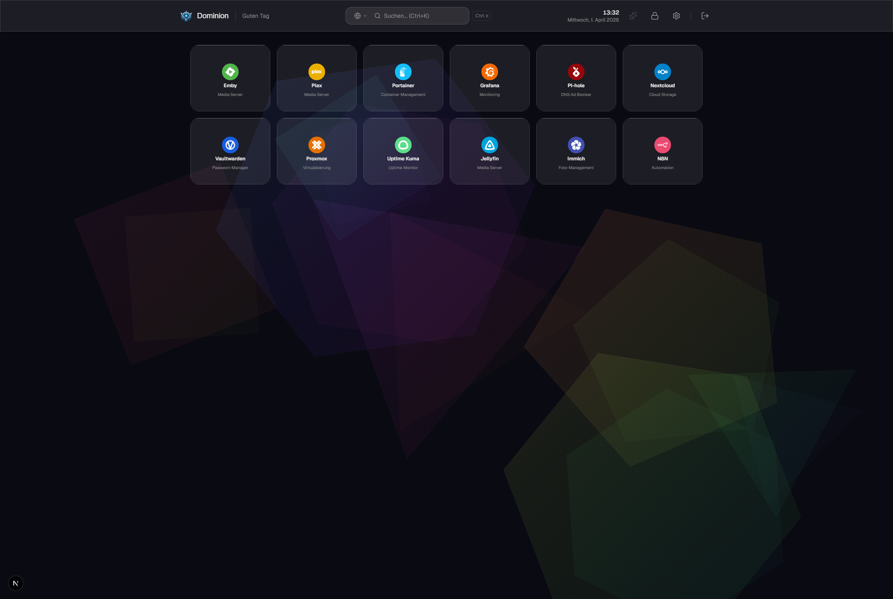
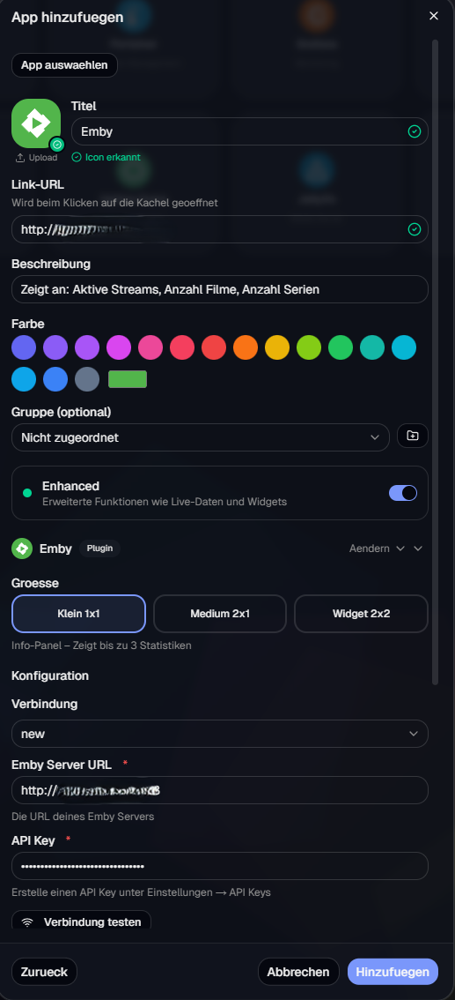
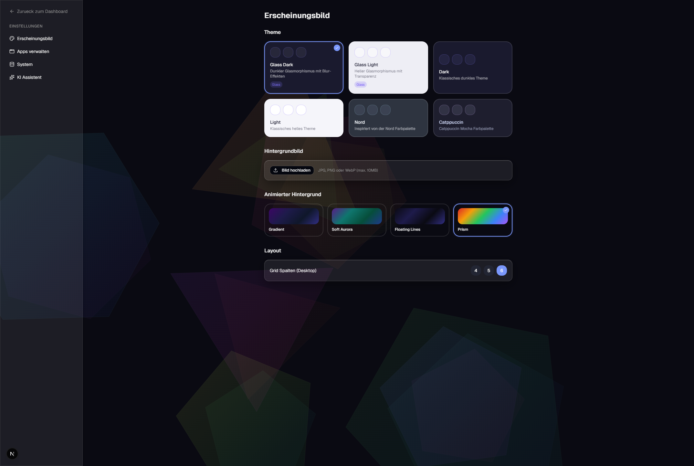
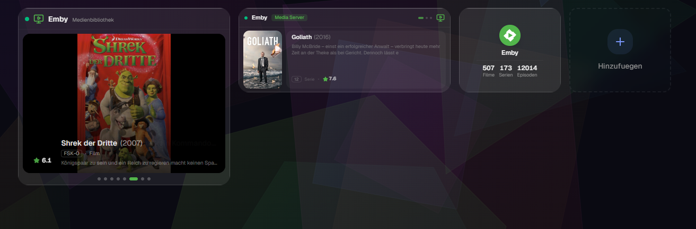

<p align="center">
  
</p>

<h1 align="center">Dominion</h1>

<p align="center">
  <strong>A self-hosted dashboard that brings your services to life.</strong><br />
  <sub>Organize your apps. See live data. Build your own plugins.</sub>
</p>

<p align="center">
  <a href="https://hub.docker.com/r/miguel1988/dominion"></a>
  
  
  
</p>

<p align="center">
  
</p>

---

## Why Dominion?

Most self-hosted dashboards are either static link pages or require editing YAML files to add a bookmark. Dominion takes a different approach: it's a real application with a database, drag-and-drop, and a **plugin system that pulls live data from your services**.

Add an app in seconds through the visual catalog. Connect it to your Emby server and see active streams, library sizes, and recently added media — right on the tile. No config files, no terminal.

Dominion is built to grow with the community. Every Enhanced App is a single-file plugin that anyone can write and contribute.

---

## Quick Start

```yaml
# docker-compose.yml
services:
  dominion:
    image: miguel1988/dominion:latest
    container_name: dominion
    ports:
      - "3000:3000"
    volumes:
      - dominion_data:/data
    environment:
      - AUTH_SECRET=change-me-to-a-long-random-string
      - AUTH_TRUST_HOST=true
      - DATABASE_URL=file:/data/dominion.db
    restart: unless-stopped

volumes:
  dominion_data:
```

```bash
docker-compose up -d
```

Open **http://localhost:3000** — the setup wizard will guide you through creating your first account.

> [!WARNING]
> Change `AUTH_SECRET` to a secure random string before exposing to the network.
> Generate one with: `openssl rand -base64 32`

---

## Features

### App Catalog & Organization



- **60+ foundation apps** with auto-detected icons from [simple-icons](https://simpleicons.org)
- Drag-and-drop tile arrangement
- Groups and sub-dashboards for organizing by category
- Command palette search with `Ctrl+K`
- Configurable grid layout (4, 5, or 6 columns)

<br clear="right" />

### Themes & Animated Backgrounds



- **6 themes**: Glass Dark, Glass Light, Dark, Light, Nord, Catppuccin
- **4 animated backgrounds**: Gradient, Soft Aurora, Floating Lines, Prism
- Custom wallpaper upload
- Full glassmorphism UI with blur effects

<br clear="right" />

### Enhanced Apps — Live Data on Your Dashboard

This is what makes Dominion different. Enhanced Apps are plugins that connect to your services and display **real-time stats and widgets** directly on dashboard tiles.

<p align="center">
  
</p>

Each Enhanced App supports up to three tile sizes:

| Size | What you see |
|------|-------------|
| **1x1** | Compact stats (streams, library count) |
| **2x1** | Detailed stats with labels and status indicators |
| **2x2** | Full widget with carousel, artwork, and rich data |

**Currently shipped:** Emby — [more plugins are being added →](docs/enhanced-apps/)

> **Want to build a plugin?** An Enhanced App is a single TypeScript file. Define your stats, config fields, and optional widget — Dominion handles the rest.
> See the [Plugin Development Guide](docs/plugin-development.md) to get started.

### Security

- Auth.js (NextAuth v5) with JWT session management
- **AES-256-GCM encryption** for all stored API keys and credentials
- Server-side API proxy — secrets never reach the browser
- Edge-compatible middleware route protection

### Docker-Native

- Multi-stage build on Node 22 Alpine — small image, fast startup
- SQLite database with persistent Docker volume — no external DB needed
- Auto-migrations on container startup — updates just work
- Health check endpoint for orchestrator integration

<details>
<summary><strong>AI Chat Integration</strong> <em>(experimental)</em></summary>

<br />

Dominion includes an early-stage AI chat panel that can connect to OpenAI, Claude, Gemini, or a local Ollama instance. Configure a provider in Settings > AI Assistant to enable a floating chat overlay on your dashboard.

This feature is experimental and will evolve in future releases.

</details>

---

## Enhanced Apps

Enhanced Apps are the heart of Dominion's plugin system. Each plugin is a self-contained TypeScript module that defines:

- **Metadata** — name, icon, color, category, description
- **Config fields** — what the user needs to provide (URL, API key, etc.)
- **Stat options** — what data to fetch and display
- **Size hints** — how to render at 1x1, 2x1, and 2x2
- **Widget component** *(optional)* — a React component for rich 2x2 rendering

```
src/plugins/builtin/
  emby/
    index.ts          ← everything in one file
```

Plugins are validated on startup, registered in the global registry, and available in the UI automatically. No core code changes needed.

| Resource | Description |
|----------|-------------|
| [Enhanced Apps Catalog](docs/enhanced-apps/) | Available plugins and their configuration |
| [Plugin Development Guide](docs/plugin-development.md) | How to build and contribute a plugin |
| [Plugin Framework Docs](ENHANCED_FRAMEWORK.md) | Architecture deep-dive for contributors |

---

## Development

```bash
git clone https://github.com/Virus250188/Dominion_Public.git
cd Dominion_Public

npm install
npx prisma migrate deploy
npx prisma db seed
npm run dev
```

Open **http://localhost:3000** — default login: `admin` / `admin123`

---

## Tech Stack

| | Technology |
|---|---|
| **Framework** | Next.js 16 · React 19 · TypeScript 5 |
| **Styling** | Tailwind CSS v4 · shadcn/ui (base-nova) |
| **Database** | SQLite via Prisma 7 · better-sqlite3 |
| **Auth** | Auth.js (NextAuth v5) · bcryptjs · JWT |
| **Drag & Drop** | @dnd-kit/react |
| **Animations** | Motion 12 · Canvas backgrounds |
| **Icons** | Lucide React · simple-icons |
| **Deployment** | Docker · Node 22 Alpine · multi-stage |

---

## Configuration

| Variable | Description | Default |
|---|---|---|
| `AUTH_SECRET` | Secret for JWT signing. **Change in production.** | `change-me-to-a-random-string` |
| `DATABASE_URL` | SQLite database path | `file:/data/dominion.db` |
| `LOG_LEVEL` | `debug` · `info` · `warn` · `error` | `info` |
| `PORT` | HTTP server port | `3000` |

---

## Roadmap

- [ ] More Enhanced App plugins (Proxmox, Plex, Jellyfin, Pi-hole, ...)
- [ ] Multi-user support with role-based access
- [ ] Notification system (webhooks, push)
- [ ] Public sharing / TV display mode

---

## Contributing

Dominion is built and maintained in spare time. Contributions of any kind are welcome — bug fixes, UI improvements, documentation, or new features.

The **best way to contribute** is by building an Enhanced App plugin for a service you use. Each plugin is a single file, and the framework handles everything else. Check the [Plugin Development Guide](docs/plugin-development.md) to get started.

Found a bug or have an idea? [Open an issue](https://github.com/Virus250188/Dominion_Public/issues).

---

## License

[MIT License](LICENSE)

---

<p align="center">
  <br />
  <sub>Built with Next.js and Claude</sub>
</p>
