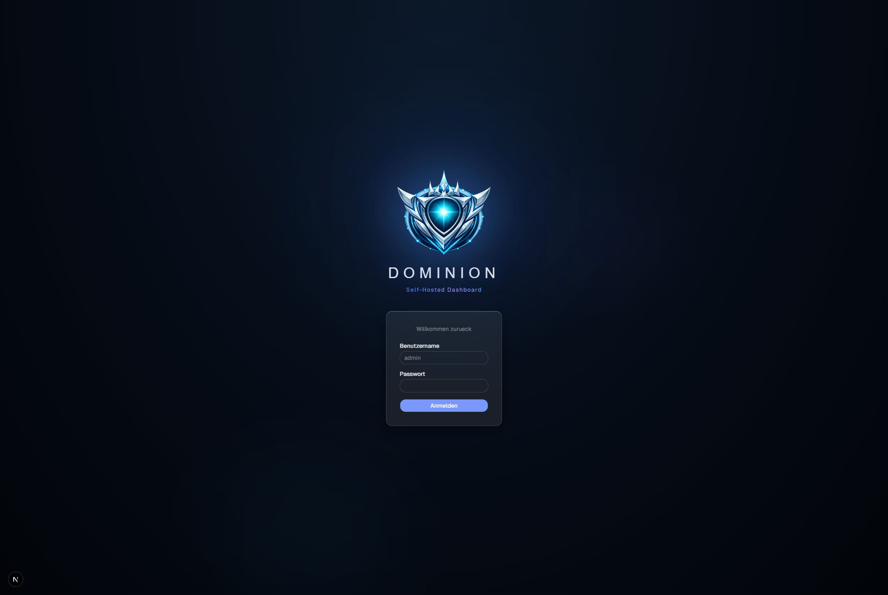

<p align="center">
  
</p>

<h3 align="center">A modern, self-hosted application dashboard with plugin system and live stats</h3>

<p align="center">
  
  
  
  
</p>

---

## Screenshots

<table>
  <tr>
    <td align="center">
      
      <br />
      <em>Login with decrypt animation</em>
    </td>
  </tr>
  <tr>
    <td align="center">
      
      <br />
      <em>Main dashboard with Prism background</em>
    </td>
  </tr>
  <tr>
    <td align="center">
      
      <br />
      <em>Enhanced App: Emby in 1x1, 2x1, and 2x2 tile sizes</em>
    </td>
  </tr>
  <tr>
    <td align="center">
      
      
      <br />
      <em>Left: Add app with auto-detection — Right: Theme & background settings</em>
    </td>
  </tr>
</table>

---

## Features

### :package: Dashboard

- **60+ foundation apps** with auto-detected icons, colors, and descriptions
- Drag-and-drop tile arrangement via `@dnd-kit/react`
- Groups and sub-dashboards for organizing related apps
- Command palette search with `Ctrl+K`
- Responsive grid layout with configurable tile sizes

### :art: Themes & Backgrounds

- 6 built-in themes: Glass Dark, Glass Light, Dark, Light, Nord, Catppuccin
- 4 animated canvas backgrounds: Gradient, Soft Aurora, Floating Lines, Prism
- Custom wallpaper upload support
- CSS custom properties for full theme control

### :electric_plug: Plugin System

- Enhanced Apps with real-time stats pulled from your services
- Multiple tile sizes: 1x1 (small), 2x1 (wide), 2x2 (medium)
- Widget rendering for rich data display at larger sizes
- Extensible plugin architecture for community contributions

### :lock: Security

- Auth.js (NextAuth v5) with JWT session tokens
- AES-256-GCM encryption for stored API keys and credentials
- Edge-compatible middleware route protection
- Server-side API proxy keeps secrets off the client

### :speech_balloon: AI Chat

- Provider support: OpenAI, Claude, Gemini, Ollama (local)
- Streaming chat responses in a floating glass panel
- Per-provider configuration in settings
- Ephemeral messages (not persisted to database)

### :whale: Docker

- One-command deploy with `docker-compose up -d`
- SQLite database with persistent Docker volume
- Auto-migrations and seed data on first run
- Multi-stage build on Node 22 Alpine

---

## Quick Start (Docker)

Create a `docker-compose.yml`:

```yaml
services:
  dominion:
    build:
      context: .
      dockerfile: docker/Dockerfile
    container_name: dominion
    ports:
      - "3000:3000"
    volumes:
      - dominion_data:/data
    environment:
      - AUTH_SECRET=change-me-to-a-random-string
      - DATABASE_URL=file:/data/dominion.db
    healthcheck:
      test: ["CMD", "wget", "-qO-", "http://localhost:3000/api/health"]
      interval: 30s
      timeout: 10s
      retries: 3
      start_period: 30s
    restart: unless-stopped

volumes:
  dominion_data:
```

Then run:

```bash
docker-compose up -d
```

Open [http://localhost:3000](http://localhost:3000) and log in with the default credentials:

> **Username:** `admin` | **Password:** `admin123`

> [!WARNING]
> Change `AUTH_SECRET` to a secure random string before deploying to production.
> Generate one with: `openssl rand -base64 32`

---

## Development Setup

```bash
# Clone the repository
git clone https://github.com/Virus250188/Dominion_Public.git
cd Dominion_Public

# Install dependencies
npm install

# Set up the database
npx prisma migrate deploy
npx prisma db seed

# Start the dev server (Turbopack)
npm run dev
```

The app will be available at [http://localhost:3000](http://localhost:3000).

---

## Enhanced Apps (Plugin System)

Dominion supports **Enhanced Apps** -- plugins that connect to your self-hosted services and display live data directly on dashboard tiles. Each plugin defines its own stats, configuration fields, and widget rendering.

**Currently shipped:** Emby — more plugins are being added incrementally.

Plugins can expose multiple stat options and support different tile sizes for progressively richer data display.

<details>
<summary>Example: Emby plugin at 2x2 size</summary>

A 2x2 Enhanced Tile shows a full widget with active streams, library counts, and server status -- all fetched server-side through the API proxy.

</details>

See [Enhanced Apps Documentation](docs/enhanced-apps/) for available plugins and configuration.

See [Plugin Development Guide](docs/plugin-development.md) for building your own.

---

## Tech Stack

| Category | Technology |
|---|---|
| **Framework** | Next.js 16, React 19, TypeScript 5 |
| **Styling** | Tailwind CSS v4, shadcn/ui (base-nova) |
| **Database** | SQLite via Prisma 7 |
| **Auth** | Auth.js (NextAuth v5 beta) |
| **Drag & Drop** | @dnd-kit/react 0.3.x |
| **Animations** | Motion 12 (Framer Motion) |
| **Icons** | Lucide React, simple-icons |
| **Docker** | Node 22 Alpine, multi-stage build |

---

## Configuration

| Variable | Description | Default |
|---|---|---|
| `AUTH_SECRET` | Secret key for JWT signing. **Must be changed in production.** | `change-me-to-a-random-string` |
| `DATABASE_URL` | SQLite database file path | `file:/data/dominion.db` |
| `LOG_LEVEL` | Logging verbosity (`debug`, `info`, `warn`, `error`) | `info` |
| `PORT` | HTTP server port | `3000` |

---

## Roadmap

- [ ] More Enhanced App plugins (Proxmox, Plex, Jellyfin, Pi-hole, ...)
- [ ] Multi-user support with role-based access
- [ ] Mobile companion app
- [ ] Notification system (webhooks, push)
- [ ] Public sharing / TV display mode

---

## Contributing

Contributions are welcome! Whether it is a new plugin, a bug fix, or a UI improvement -- feel free to open an issue or submit a pull request.

The easiest way to contribute is by building a new Enhanced App plugin. See the [Plugin Development Guide](docs/plugin-development.md) to get started.

---

## License

This project is licensed under the [MIT License](LICENSE).

---

<p align="center">
  <sub>Built with Next.js and Claude</sub>
</p>
